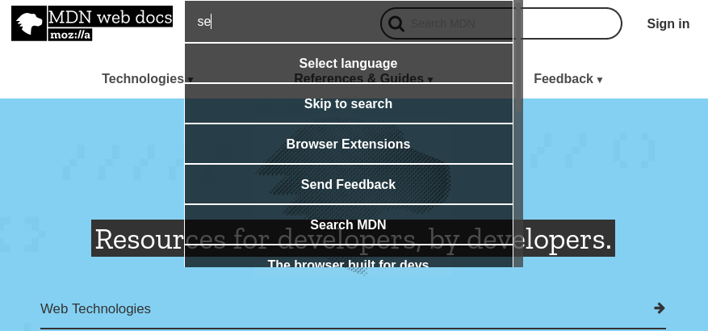

# web-palette
A Web Extension that provides a command palette for easily navigating a page with your keyboard.

## How it works

- Injects a contect script on all your pages which watches for `ctrl+e`
- Gets all buttons, anchors, and inputs on the page
- Uses best effort to generate labels for them
- Renders a list of buttons with a fuzzy matching filter
- Hitting enter in the filter or clicking a button focuses that element
- From there you can hit `enter` to invoke the element or start typing into the input
- You can close the pallet with `ctrl+e` or `escape` or have it auto-close on focusing

## Future

- User defined commands that can be added
- More inegration with browser (closing the page and stuff)

## Credits

Largely inspired by the [Commander](https://github.com/robingzk/mchacks2018) extension. 😁
